# 🌌 Nova Collective 🚀

### *Building the Decentralized Universe* 

---

### ✨ *Exploring the Infinite Possibilities of Decentralized Technology* ✨

 

## 🌟 About Our Cosmic Mission

 

We are a **passionate collective of blockchain developers** navigating through the vast universe of Web3 technologies. Like stars forming constellations, we unite to create **innovative decentralized solutions** that illuminate the path to a more open, transparent, and equitable digital future.

Our mission transcends traditional boundaries—we're not just writing code, we're **architecting the infrastructure of tomorrow's internet**. From the depths of smart contract security to the heights of user-friendly dApps, we explore every corner of this exciting blockchain cosmos.

```mermaid
graph LR
    A[🌍 Web2] -->|Evolution| B[🌌 Web3]
    B --> C[🔗 Blockchain]
    B --> D[💰 DeFi]
    B --> E[🎨 NFTs]
    B --> F[🏛️ DAOs]
    C --> G[✨ Decentralized Future]
    D --> G
    E --> G
    F --> G
    style B fill:#00D9FF,stroke:#0099CC,stroke-width:3px,color:#000
    style G fill:#FFD700,stroke:#FFA500,stroke-width:3px,color:#000
```

 

## 🛠️ Our Stellar Tech Stack

### ⛓️ Blockchain Foundations

### 🔮 Smart Contract Development

### 🌐 Web3 Frontend

### 🗄️ Decentralized Storage & Infrastructure

### 💻 Backend & Tools

 

## 🌠 What We're Building

<table>
<tr>
<td width="50%">

### 💎 DeFi Protocols
Building the next generation of **decentralized finance** solutions:
- 🏦 Lending & Borrowing Platforms
- 💱 Decentralized Exchanges (DEXs)
- 🌊 Liquidity Pools & Yield Farming
- 📊 Algorithmic Trading Bots

</td>
<td width="50%">

### 🎨 NFT Ecosystems
Creating immersive **digital asset** experiences:
- 🖼️ NFT Marketplaces
- 🎮 GameFi & Play-to-Earn
- 🎵 Music & Art Platforms
- 🏆 Dynamic NFT Collections

</td>
</tr>
<tr>
<td width="50%">

### 🏛️ DAO Infrastructure
Empowering **decentralized governance**:
- 🗳️ Voting & Proposal Systems
- 💰 Treasury Management
- 👥 Community Tools
- 📜 On-chain Governance

</td>
<td width="50%">

### 🔐 Security & Auditing
Ensuring **bulletproof smart contracts**:
- 🛡️ Security Audits
- 🔍 Vulnerability Testing
- 📝 Best Practices Documentation
- 🎯 Penetration Testing

</td>
</tr>
</table>

 

## 🌌 Join Our Cosmic Journey

We believe in the power of **collaboration** and **open-source** development. The universe of Web3 is vast, and together we can explore it faster and more effectively.

### 🤝 How to Contribute

Whether you're a seasoned blockchain developer or just starting your journey into Web3, there's a place for you in our collective!

---

### 🌟 Our Values

| 🔓 **Open Source** | 🌍 **Inclusive** | 🔒 **Secure** | 🚀 **Innovative** |
|:---:|:---:|:---:|:---:|
| We believe in transparency and community-driven development | Everyone is welcome to contribute and learn | Security is our top priority in every project | Pushing the boundaries of what's possible |

 

## 💫 Connect With Us

 

---

 

**✨ Building the Future, One Block at a Time ✨**

*"In the vast universe of possibilities, we choose to build the decentralized future."*

 

